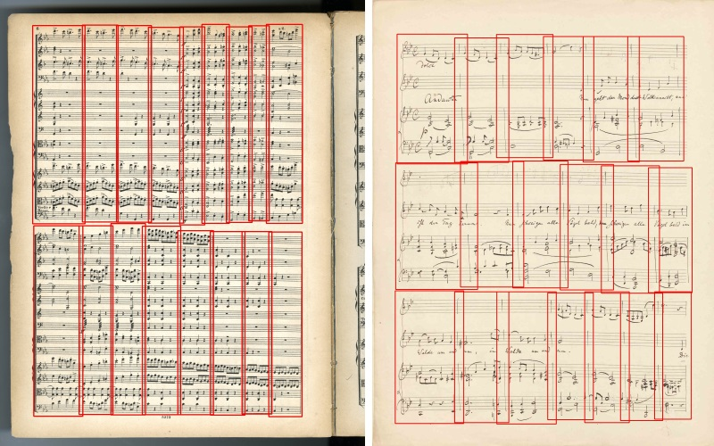
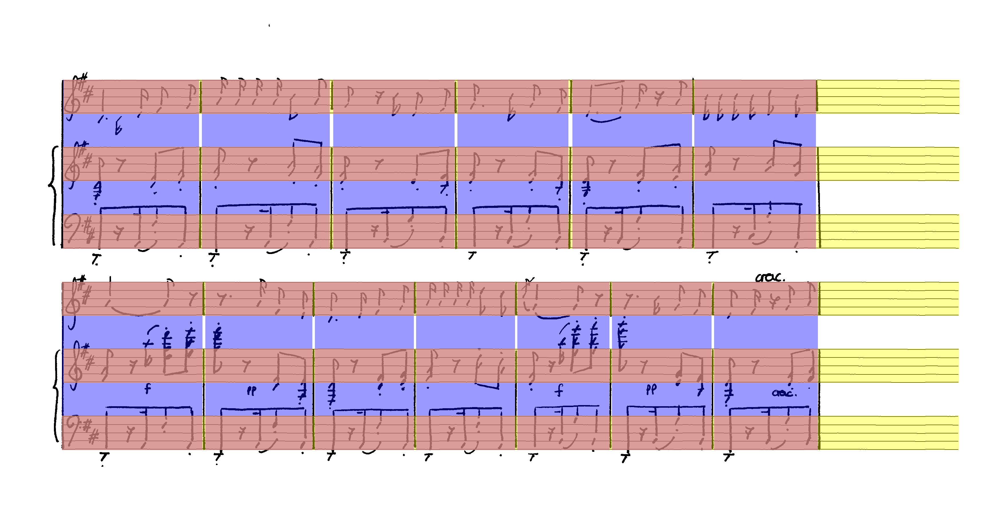
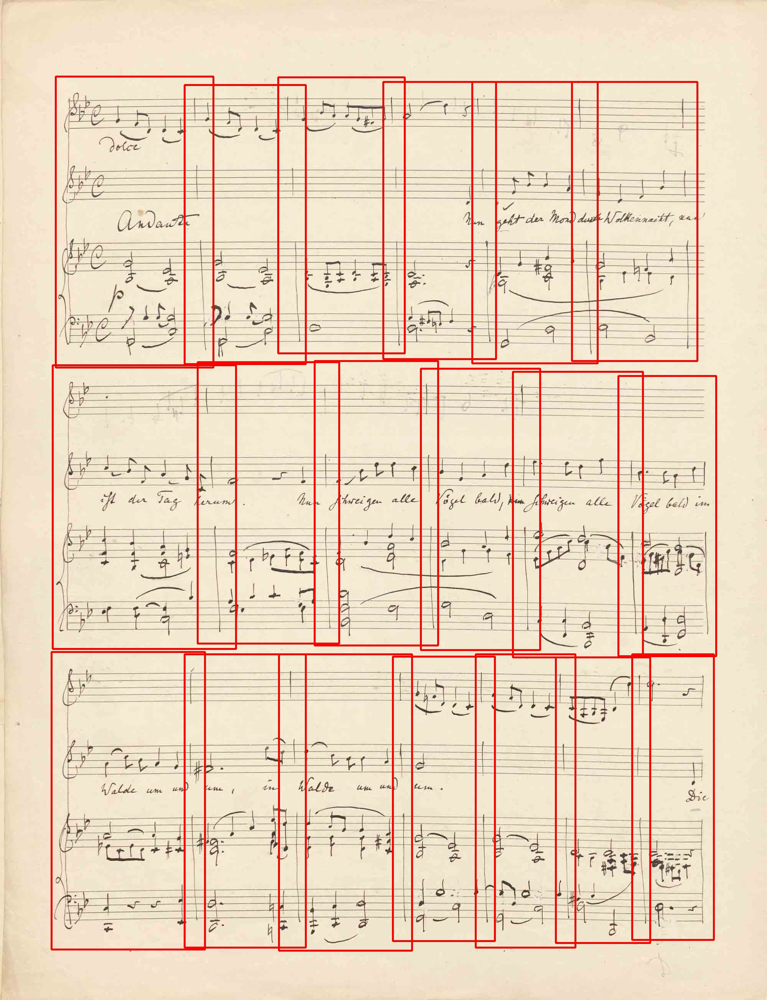

# Measure Detector

This is the repository for the fast and reliable Measure detector with Deep Learning, based on the Tensorflow Object Detection API: 
 
 

# Preparing the application
This repository contains several scripts that can be used independently of each other. 
Before running them, make sure that you have the necessary requirements installed. 

## Install required libraries

- Python 3.6
- Tensorflow 1.9.0 (or optionally tensorflow-gpu 1.9.0)
- pycocotools (more [infos](https://github.com/matterport/Mask_RCNN/issues/6#issuecomment-341503509))
    - On Linux, run `pip install git+https://github.com/waleedka/cocoapi.git#egg=pycocotools&subdirectory=PythonAPI`
    - On Windows, run `pip install git+https://github.com/philferriere/cocoapi.git#egg=pycocotools^&subdirectory=PythonAPI`
- Some libraries, as specified in [requirements.txt](MusicObjectDetector/requirements.txt)

## Adding source to Python path
There are two ways of making sure, that the python script discoveres the correct binaries:

### Permanently linking the source code as pip package
To permanently link the source-code of the project, for Python to be able to find it, you can link the two packages by running:
```bash
# From MeasureDetector/research/
pip install -e .
cd slim
# From inside MeasureDetector/research/slim
pip install -e .
```

### Temporarily adding the source code before starting the training
Make sure you have all required folders appended to the [Python path](https://github.com/tensorflow/models/blob/master/research/object_detection/g3doc/installation.md#add-libraries-to-pythonpath). This can temporarily be done inside a shell, before calling any training scrips by the following commands:

For Linux:
```bash
# From MeasureDetector/research/
export PYTHONPATH=$PYTHONPATH:`pwd`:`pwd`/slim
```

For Windows (Powershell):
```powershell
$pathToGitRoot = "[GIT_ROOT]"
$pathToSourceRoot = "$($pathToGitRoot)/object_detection"
$env:PYTHONPATH = "$($pathToGitRoot);$($pathToSourceRoot);$($pathToGitRoot)/slim"
```

## Build Protobuf files on Linux

```bash
# From MeasureDetector/research/
protoc object_detection/protos/*.proto --python_out=.
```

## Build Protobuf files on Windows

> Run [`DownloadAndBuildProtocolBuffers.ps1`](MusicObjectDetector/DownloadAndBuildProtocolBuffers.ps1) to automate this step or manually build the protobufs by first installing [protocol buffers](https://developers.google.com/protocol-buffers/docs/downloads) and then run:

```bash
# From MeasureDetector/research/
protoc object_detection/protos/*.proto --python_out=.
```

Note, that you have to use [version 3.4.0](https://github.com/google/protobuf/releases/download/v3.4.0/) because of a [bug in 3.5.0 and 3.5.1](https://github.com/google/protobuf/issues/3957)

# Dataset

## MUSCIMA++
The MUSCIMA++ dataset contains 140 images of handwritten music scores with manually annotated measure and staff line information. Therefore it includes three different types of information: 

- Staff lines (yellow)
- Staff measures (a measure on a single staff, red)
- System measures (a measure that spans across the entire system, blue)



> Such images can be produced with the `draw_bounding_boxes.py` script that takes an image, a json with the annotations of those three categories and creates the annotated figure.

To obtain the MUSCIMA++ dataset, simply run the `MeasureDetector/download_muscima-pp_dataset.py` script.

Afterwards you have to convert the dataset to into the TF-Record format for Tensorflow to be able to read the data quickly. Run `create_tf_record.py -data_dir data/muscima_pp -num_shards 1` to do so.

## Edirom
For working with an Edirom dataset, you have to download that dataset first with the `download_edirom_dataset.py`. To avoid repeated crawling of that service, the URLs have to be provided manually. Please contact us if you are interested in this dataset.
 
 
 
# Running the training

## Adjusting paths
For running the training, you need to change the paths, according to your system

- in the configuration, you want to run, e.g. `configurations/faster_rcnn_inception_resnet_v2_atrous_muscima_pretrained_reduced_classes.config`
- if you use them, in the PowerShell scripts in the `training_scripts` folder.

Run the actual training script, by using the pre-defined Powershell scripts in the `training_scripts` folder, or by directly calling

```
# Start the training
python [GIT_ROOT]/research/object_detection/train.py --logtostderr --pipeline_config_path="[GIT_ROOT]/MusicObjectDetector/configurations/[SELECTED_CONFIG].config" --train_dir="[GIT_ROOT]/MusicObjectDetector/data/checkpoints-[SELECTED_CONFIG]-train"

# Start the validation
python [GIT_ROOT]/research/object_detection/eval.py --logtostderr --pipeline_config_path="[GIT_ROOT]/MusicObjectDetector/configurations/[SELECTED_CONFIG].config" --checkpoint_dir="[GIT_ROOT]/MusicObjectDetector/data/checkpoints-[SELECTED_CONFIG]-train" --eval_dir="[GIT_ROOT]/MusicObjectDetector/data/checkpoints-[SELECTED_CONFIG]-validate"
```

A few remarks: The two scripts can and should be run at the same time, to get a live evaluation during the training. The values, may be visualized by calling `tensorboard --logdir=[GIT_ROOT]/MusicObjectDetector/data`.

## Restricting GPU memory usage

Notice that usually Tensorflow allocates the entire memory of your graphics card for the training. In order to run both training and validation at the same time, you might have to restrict Tensorflow from doing so, by opening `train.py` and `eval.py` and uncomment the respective (prepared) lines in the main function. E.g.:

```
gpu_options = tf.GPUOptions(per_process_gpu_memory_fraction=0.3)
sess = tf.Session(config=tf.ConfigProto(gpu_options=gpu_options))
```

## Training with pre-trained weights

It is recommended that you use pre-trained weights for known networks to speed up training and improve overall results. To do so, head over to the [Tensorflow detection model zoo](https://github.com/tensorflow/models/blob/master/research/object_detection/g3doc/detection_model_zoo.md), download and unzip the respective trained model, e.g. `faster_rcnn_inception_resnet_v2_atrous_coco` for reproducing the best results, we obtained. The path to the unzipped files, must be specified inside of the configuration in the `train_config`-section, e.g.

```
train-config: {
  fine_tune_checkpoint: "C:/Users/Alex/Repositories/MusicObjectDetector-TF/MusicObjectDetector/data/faster_rcnn_inception_resnet_v2_atrous_coco_2017_11_08/model.ckpt"
  from_detection_checkpoint: true
}
```

> Note that inside that folder, there is no actual file, called `model.ckpt`, but multiple files called `model.ckpt.[something]`.


# License

Published under MIT License,

Copyright (c) 2018 [Alexander Pacha](http://alexanderpacha.com), [TU Wien](https://www.ims.tuwien.ac.at/people/alexander-pacha)

Permission is hereby granted, free of charge, to any person obtaining a copy
of this software and associated documentation files (the "Software"), to deal
in the Software without restriction, including without limitation the rights
to use, copy, modify, merge, publish, distribute, sublicense, and/or sell
copies of the Software, and to permit persons to whom the Software is
furnished to do so, subject to the following conditions:

The above copyright notice and this permission notice shall be included in all
copies or substantial portions of the Software.

THE SOFTWARE IS PROVIDED "AS IS", WITHOUT WARRANTY OF ANY KIND, EXPRESS OR
IMPLIED, INCLUDING BUT NOT LIMITED TO THE WARRANTIES OF MERCHANTABILITY,
FITNESS FOR A PARTICULAR PURPOSE AND NONINFRINGEMENT. IN NO EVENT SHALL THE
AUTHORS OR COPYRIGHT HOLDERS BE LIABLE FOR ANY CLAIM, DAMAGES OR OTHER
LIABILITY, WHETHER IN AN ACTION OF CONTRACT, TORT OR OTHERWISE, ARISING FROM,
OUT OF OR IN CONNECTION WITH THE SOFTWARE OR THE USE OR OTHER DEALINGS IN THE
SOFTWARE.
